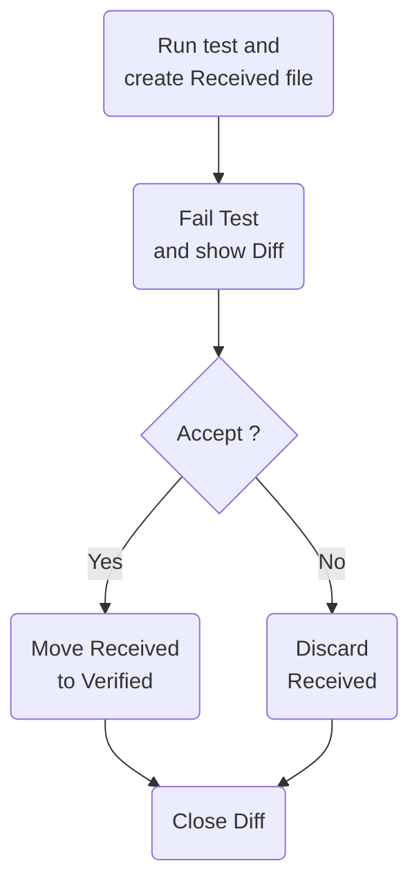
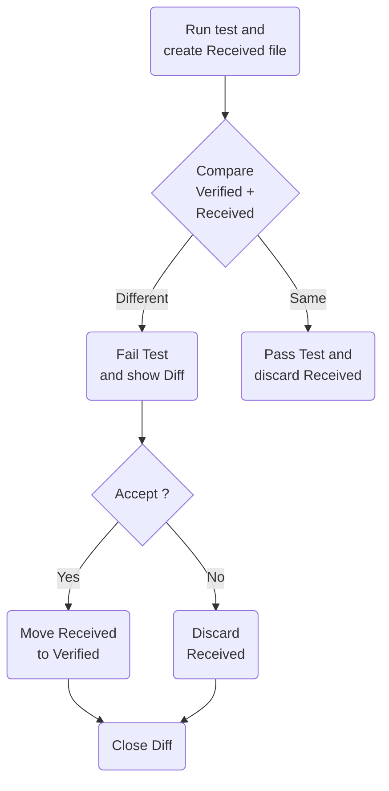

<!--
GENERATED FILE - DO NOT EDIT
This file was generated by [MarkdownSnippets](https://github.com/SimonCropp/MarkdownSnippets).
Source File: /readme.source.md
To change this file edit the source file and then run MarkdownSnippets.
-->

#  Verify

[](https://github.com/orgs/VerifyTests/discussions)
[](https://ci.appveyor.com/project/SimonCropp/Verify)
[](https://www.nuget.org/packages/Verify.NUnit/)
[](https://www.nuget.org/packages/Verify.Xunit/)
[](https://www.nuget.org/packages/Verify.Fixie/)
[](https://www.nuget.org/packages/Verify.Expecto/)
[](https://www.nuget.org/packages/Verify.MSTest/)
[](https://www.nuget.org/packages/Verify.ClipboardAccept/)

Verify is a snapshot tool that simplifies the assertion of complex data models and documents.

Verify is called on the test result during the assertion phase. It serializes that result and stores it in a file that
matches the test name. On the next test execution, the result is again serialized and compared to the existing file. The
test will fail if the two snapshots do not match: either the change is unexpected, or the reference snapshot needs to be
updated to the new result.

**See [Milestones](../../milestones?state=closed) for release notes.**


## Sponsors

A HUGE Thank-You to [AWS](https://github.com/aws) for sponsoring this project in September 2023 as part of
the [AWS Open Source Software Fund](https://github.com/aws/dotnet-foss).

Thanks to [DataDog](https://github.com/DataDog) for the generous monthly sponsorship.


## [Getting started wizard](/docs/wiz/readme.md)

Get customized instructions for the specific combination of Operating System, IDE, Test Framework, and Build Server.

[Start wizard](/docs/wiz/readme.md).


## NuGet packages

* https://nuget.org/packages/Verify.NUnit/
* https://nuget.org/packages/Verify.Xunit/
* https://nuget.org/packages/Verify.Fixie/
* https://nuget.org/packages/Verify.Expecto/
* https://nuget.org/packages/Verify.MSTest/


## Snapshot management

Accepting or declining a snapshot file is part of the core workflow of Verify. There are several ways to do this and the
approach(s) selected is a personal preference.

* In the Windows Tray via [DiffEngineTray](https://github.com/VerifyTests/DiffEngine/blob/main/docs/tray.md)
* [ReSharper test runner support](https://plugins.jetbrains.com/plugin/17241-verify-support) ([Source](https://github.com/matkoch/resharper-verify))
* [Rider test runner support](https://plugins.jetbrains.com/plugin/17240-verify-support) ([Source](https://github.com/matkoch/resharper-verify))
* [Via the clipboard](/docs/clipboard.md).
* Manually making the change in the [launched diff tool](https://github.com/VerifyTests/DiffEngine#supported-tools).
  Either with a copy paste, or some tools have commands to automate this via a shortcut or a button.
* Manually on the file system. By renaming the `.received.` file to `.verified.`. This can be automated via a scripted
  to bulk accept all (by matching a pattern) `.received.` files.
* Using the dotnet tool [Verify.Terminal](https://github.com/VerifyTests/Verify.Terminal).


## Usage


### ImplicitUsings

**All examples use [Implicit Usings](https://docs.microsoft.com/en-us/dotnet/core/project-sdk/msbuild-props#implicitusings). Ensure the following is set to have examples compile correctly `<ImplicitUsings>enable</ImplicitUsings>`**<!-- include: implicit-usings. path: /docs/mdsource/implicit-usings.include.md -->

If `ImplicitUsings` are not enabled, substitute usages of `Verify()` with `Verifier.Verify()`.<!-- endInclude -->


### Class being tested

Given a class to be tested:

<!-- snippet: ClassBeingTested -->
<a id='snippet-classbeingtested'></a>
```cs
public static class ClassBeingTested
{
    public static Person FindPerson() =>
        new()
        {
            Id = new("ebced679-45d3-4653-8791-3d969c4a986c"),
            Title = Title.Mr,
            GivenNames = "John",
            FamilyName = "Smith",
            Spouse = "Jill",
            Children =
            [
                "Sam",
                "Mary"
            ],
            Address = new()
            {
                Street = "4 Puddle Lane",
                Country = "USA"
            }
        };
}
```
<sup><a href='/src/TargetLibrary/ClassBeingTested.cs#L1-L26' title='Snippet source file'>snippet source</a> | <a href='#snippet-classbeingtested' title='Start of snippet'>anchor</a></sup>
<!-- endSnippet -->


### NUnit

Support for [NUnit](https://nunit.org/)

<!-- snippet: SampleTestNUnit -->
<a id='snippet-sampletestnunit'></a>
```cs
[TestFixture]
public class Sample
{
    [Test]
    public Task Test()
    {
        var person = ClassBeingTested.FindPerson();
        return Verify(person);
    }
}
```
<sup><a href='/src/Verify.NUnit.Tests/Snippets/Sample.cs#L1-L14' title='Snippet source file'>snippet source</a> | <a href='#snippet-sampletestnunit' title='Start of snippet'>anchor</a></sup>
<!-- endSnippet -->


### xUnit

Support for [xUnit](https://xunit.net/)

<!-- snippet: SampleTestXunit -->
<a id='snippet-sampletestxunit'></a>
```cs
[UsesVerify]
public class Sample
{
    [Fact]
    public Task Test()
    {
        var person = ClassBeingTested.FindPerson();
        return Verify(person);
    }
}
```
<sup><a href='/src/Verify.Xunit.Tests/Snippets/Sample.cs#L1-L14' title='Snippet source file'>snippet source</a> | <a href='#snippet-sampletestxunit' title='Start of snippet'>anchor</a></sup>
<!-- endSnippet -->


### Fixie

Support for [Fixie](http://fixie.github.io/)

<!-- snippet: SampleTestFixie -->
<a id='snippet-sampletestfixie'></a>
```cs
public class Sample
{
    public Task Test()
    {
        var person = ClassBeingTested.FindPerson();
        return Verify(person);
    }
}
```
<sup><a href='/src/Verify.Fixie.Tests/Snippets/Sample.cs#L1-L12' title='Snippet source file'>snippet source</a> | <a href='#snippet-sampletestfixie' title='Start of snippet'>anchor</a></sup>
<!-- endSnippet -->


### Expecto

Support for [Expecto](https://github.com/haf/expecto)

<!-- snippet: SampleTestExpecto -->
<a id='snippet-sampletestexpecto'></a>
```fs
open Expecto
open VerifyTests
open VerifyExpecto

[<Tests>]
let tests =
    testTask "findPerson" {
        let person = ClassBeingTested.FindPerson()
        do! Verifier.Verify("findPerson", person)
    }
```
<sup><a href='/src/Verify.Expecto.FSharpTests/Tests.fs#L2-L13' title='Snippet source file'>snippet source</a> | <a href='#snippet-sampletestexpecto' title='Start of snippet'>anchor</a></sup>
<!-- endSnippet -->


#### Caveats

Due to the nature of the Expecto implementation, the following APIs in Verify are not supported.

* `settings.UseParameters()`
* `settings.UseTextForParameters()`

### MSTest

Support for [MSTest](https://github.com/Microsoft/testfx-docs)

<!-- snippet: SampleTestMSTest -->
<a id='snippet-sampletestmstest'></a>
```cs
[TestClass]
public class Sample :
    VerifyBase
{
    [TestMethod]
    public Task Test()
    {
        var person = ClassBeingTested.FindPerson();
        return Verify(person);
    }
}
```
<sup><a href='/src/Verify.MSTest.Tests/Snippets/Sample.cs#L3-L17' title='Snippet source file'>snippet source</a> | <a href='#snippet-sampletestmstest' title='Start of snippet'>anchor</a></sup>
<!-- endSnippet -->


### Initial Verification

No existing `.verified.` file.



When the test is initially run will fail. If a [Diff Tool](https://github.com/VerifyTests/DiffEngine) is detected it
will display the diff.


To verify the result:

* Execute the command from the [Clipboard](/docs/clipboard.md), or
* Accept with [DiffEngineTray tool](https://github.com/VerifyTests/DiffEngine/blob/master/docs/tray.md),
* Accept with [ReSharper Addin](https://plugins.jetbrains.com/plugin/17241-verify-support)
  or [Rider Addin](https://plugins.jetbrains.com/plugin/17240-verify-support)
* Use the diff tool to accept the changes, or
* Manually copy the text to the new file


#### Verified result

This will result in the `Sample.Test.verified.txt` being created:

<!-- snippet: Verify.Xunit.Tests/Snippets/Sample.Test.verified.txt -->
<a id='snippet-Verify.Xunit.Tests/Snippets/Sample.Test.verified.txt'></a>
```txt
{
  GivenNames: John,
  FamilyName: Smith,
  Spouse: Jill,
  Address: {
    Street: 4 Puddle Lane,
    Country: USA
  },
  Children: [
    Sam,
    Mary
  ],
  Id: Guid_1
}
```
<sup><a href='/src/Verify.Xunit.Tests/Snippets/Sample.Test.verified.txt#L1-L14' title='Snippet source file'>snippet source</a> | <a href='#snippet-Verify.Xunit.Tests/Snippets/Sample.Test.verified.txt' title='Start of snippet'>anchor</a></sup>
<!-- endSnippet -->


### Subsequent Verification

Existing `.verified.` file.



If the implementation of `ClassBeingTested` changes:

<!-- snippet: ClassBeingTestedChanged -->
<a id='snippet-classbeingtestedchanged'></a>
```cs
public static class ClassBeingTested
{
    public static Person FindPerson() =>
        new()
        {
            Id = new("ebced679-45d3-4653-8791-3d969c4a986c"),
            Title = Title.Mr,
            // Middle name added
            GivenNames = "John James",
            FamilyName = "Smith",
            Spouse = "Jill",
            Children =
            [
                "Sam",
                "Mary"
            ],
            Address = new()
            {
                // Address changed
                Street = "64 Barnett Street",
                Country = "USA"
            }
        };
}
```
<sup><a href='/src/TargetLibrary/ClassBeingTestedChanged.cs#L3-L30' title='Snippet source file'>snippet source</a> | <a href='#snippet-classbeingtestedchanged' title='Start of snippet'>anchor</a></sup>
<!-- endSnippet -->

And the test is re run it will fail.


#### The [Diff Tool](https://github.com/VerifyTests/DiffEngine) will display the diff:


The same approach can be used to verify the results and the change to `Sample.Test.verified.txt` is committed to source
control along with the change to `ClassBeingTested`.


### Async

`Verify()` has overloads that accept `Task<T>`, `ValueTask<T>`, and `IAsyncEnumerable<T>`. These are `await`ed before
verification.

There is also an overload that accepts `Func<Task<T>>`, which works well with `async` lambda expressions:

<!-- snippet: VerifyFuncOfTaskOfT -->
<a id='snippet-verifyfuncoftaskoft'></a>
```cs
await Verify(
    async () => new
    {
        Foo = await repo.GetFoo(id),
        Bars = await repo.GetBars(id)
    });
```
<sup><a href='/src/Verify.Tests/Snippets/Snippets.cs#L177-L186' title='Snippet source file'>snippet source</a> | <a href='#snippet-verifyfuncoftaskoft' title='Start of snippet'>anchor</a></sup>
<!-- endSnippet -->


### VerifyJson

`VerifyJson` performs the following actions

* Convert to `JToken` (if necessary).
* Apply [ignore member by name](/docs/serializer-settings.md#ignore-member-by-name) for keys.
* PrettyPrint the resulting text.

<!-- snippet: VerifyJson -->
<a id='snippet-verifyjson'></a>
```cs
[Fact]
public Task VerifyJsonString()
{
    var json = "{'key': {'msg': 'No action taken'}}";
    return VerifyJson(json);
}

[Fact]
public Task VerifyJsonStream()
{
    var json = "{'key': {'msg': 'No action taken'}}";
    var stream = new MemoryStream(Encoding.UTF8.GetBytes(json));
    return VerifyJson(stream);
}

[Fact]
public Task VerifyJsonJToken()
{
    var json = "{'key': {'msg': 'No action taken'}}";
    var target = JToken.Parse(json);
    return Verify(target);
}
```
<sup><a href='/src/Verify.Tests/JsonTests.cs#L184-L209' title='Snippet source file'>snippet source</a> | <a href='#snippet-verifyjson' title='Start of snippet'>anchor</a></sup>
<!-- endSnippet -->

Results in:

<!-- snippet: JsonTests.VerifyJsonString.verified.txt -->
<a id='snippet-JsonTests.VerifyJsonString.verified.txt'></a>
```txt
{
  key: {
    msg: No action taken
  }
}
```
<sup><a href='/src/Verify.Tests/JsonTests.VerifyJsonString.verified.txt#L1-L5' title='Snippet source file'>snippet source</a> | <a href='#snippet-JsonTests.VerifyJsonString.verified.txt' title='Start of snippet'>anchor</a></sup>
<!-- endSnippet -->


## Source control: Received and Verified files


### Includes/Excludes

 * **All `*.received.*` files should be excluded from source control.**<!-- include: include-exclude. path: /docs/mdsource/include-exclude.include.md -->

eg. add the following to `.gitignore`

```
*.received.*
```

If using [UseSplitModeForUniqueDirectory](/docs/naming.md#usesplitmodeforuniquedirectory) also include:

`*.received/`


All `*.verified.*` files should be committed to source control.<!-- endInclude -->


## Text file settings

Text variants of verified and received have the following characteristics:<!-- include: text-file-settings. path: /docs/mdsource/text-file-settings.include.md -->

 * UTF8 with a [Byte order mark (BOM)](https://en.wikipedia.org/wiki/Byte_order_mark)
 * Newlines as line-feed (lf)
 * No trailing newline

This manifests in several ways:


**Source control settings**

All text extensions of `*.verified.*` should have:

 * `eol` set to `lf`
 * `working-tree-encoding` set to `UTF-8`

eg add the following to `.gitattributes`

```
*.verified.txt text eol=lf working-tree-encoding=UTF-8
*.verified.xml text eol=lf working-tree-encoding=UTF-8
*.verified.json text eol=lf working-tree-encoding=UTF-8
```

**EditorConfig settings**

If modifying text verified/received files in an editor, it is desirable for the editor to respect the above conventions. For [EditorConfig](https://editorconfig.org/) enabled the following can be used:

```
# Verify settings
[*.{received,verified}.{txt,xml,json}]
charset = "utf-8-bom"
end_of_line = lf
indent_size = unset
indent_style = unset
insert_final_newline = false
tab_width = unset
trim_trailing_whitespace = false
```


*Note that the above are suggested for subset of text extension. Add others as required based on the text file types being verified.*<!-- endInclude -->


## Static settings

Most settings are available at the both global level and at the instance level.

When modifying settings at the both global level it should be done using a Module Initializer:

<!-- snippet: StaticSettings.cs -->
<a id='snippet-StaticSettings.cs'></a>
```cs
[UsesVerify]
public class StaticSettings
{
    [Fact]
    public Task Test() =>
        Verify("String to verify");
}

public static class StaticSettingsUsage
{
    [ModuleInitializer]
    public static void Initialize() =>
        VerifierSettings.AddScrubber(_ => _.Replace("String to verify", "new value"));
}
```
<sup><a href='/src/Verify.Tests/StaticSettings.cs#L1-L14' title='Snippet source file'>snippet source</a> | <a href='#snippet-StaticSettings.cs' title='Start of snippet'>anchor</a></sup>
<!-- endSnippet -->


## VerifyResult

In some scenarios it can be helpful to get access to the resulting `*.verified.*` files after a successful run. For
example to do an explicit check for contains or not-contains in the resulting text. To allow this all Verify methods
return a `VerifyResult`.

<!-- snippet: VerifyResult -->
<a id='snippet-verifyresult'></a>
```cs
var result = await Verify(
    new
    {
        Property = "Value To Check"
    });
Assert.Contains("Value To Check", result.Text);
```
<sup><a href='/src/Verify.Tests/Tests.cs#L342-L351' title='Snippet source file'>snippet source</a> | <a href='#snippet-verifyresult' title='Start of snippet'>anchor</a></sup>
<!-- endSnippet -->

If using `Verifier.Throws`, the resulting `Exception` will also be accessible

<!-- snippet: ExceptionResult -->
<a id='snippet-exceptionresult'></a>
```cs
var result = await Throws(MethodThatThrows);
Assert.NotNull(result.Exception);
```
<sup><a href='/src/Verify.Tests/ThrowsTests.cs#L176-L181' title='Snippet source file'>snippet source</a> | <a href='#snippet-exceptionresult' title='Start of snippet'>anchor</a></sup>
<!-- endSnippet -->


## CurrentFile

Utility for finding paths based on the current file.

<!-- snippet: CurrentFile.cs -->
<a id='snippet-CurrentFile.cs'></a>
```cs
using IOPath = System.IO.Path;

namespace VerifyTests;

public static class CurrentFile
{
    public static string Path([CallerFilePath] string file = "") =>
        file;

    public static string Directory([CallerFilePath] string file = "") =>
        IOPath.GetDirectoryName(file)!;

    public static string Relative(string relative, [CallerFilePath] string file = "")
    {
        var directory = IOPath.GetDirectoryName(file)!;
        return IOPath.Combine(directory, relative);
    }
}
```
<sup><a href='/src/Verify/CurrentFile.cs#L1-L18' title='Snippet source file'>snippet source</a> | <a href='#snippet-CurrentFile.cs' title='Start of snippet'>anchor</a></sup>
<!-- endSnippet -->


## Versioning

Verify follows [Semantic Versioning](https://semver.org/). The same applies for [extensions to Verify](#extensions).
Small changes in the resulting snapshot files may be deployed in a minor version. As such nuget updates to `Verify.*`
should be done as follows:

* Updates all `Verify.*`packages in isolation
* Re-run all tests.
* If there are changes, ensure they look correct given the release notes. If the changes do not look correct, raise an
  issue.
* Accept those changes.

Snapshot changes do not trigger a major version change to avoid
causing [Diamond dependency](https://en.wikipedia.org/wiki/Dependency_hell#Problems) issues for downstream extensions.


## Unit testing inside virtualized environment

Unit tests referencing `Verify` (including unit tests within this repository as well as any other code
referencing `Verify`) can be run and debugged on a local virtualized environment supported
by [Visual Studio Remote Testing](https://learn.microsoft.com/en-us/visualstudio/test/remote-testing?view=vs-2022).
Initial configurations have been added for `WSL` and net 7.0 linux docker via `testenvironments.json` (for third party
code, the file needs to be copied or recreated next to the `.sln` solution file for solution to leverage the
functionality).

Upon opening the Tests Explorer the advanced environments are available in the GUI:


This readme will not discuss definitive list of details for proper setup of the environments instead refer the following
information sources and warn about particular gotchas:

* WSL runs
    * Install [WSL](https://learn.microsoft.com/en-us/windows/wsl/about).
    * Install a [distribution](https://aka.ms/wslstore).
    * [Install .NET Runtime](https://learn.microsoft.com/en-us/dotnet/core/install/linux-ubuntu)
* Docker runs
    * Install [Docker Desktop](https://www.docker.com/products/docker-desktop/)
    * First run of docker scenario might need elevation ([Test project does not reference any .NET NuGet adapter](https://developercommunity.visualstudio.com/t/test-project-does-not-reference-any-net-nuget-adap/1311698) error)
* Third party test runners might not support this feature.
  Use [Visual Studio Test Explorer](https://learn.microsoft.com/en-us/visualstudio/test/run-unit-tests-with-test-explorer).


## Media

* [I want to do a snapshot test with C# (26 Dec 2023)](https://zzzkan.me/blog/verify-tests/)
* [Introduction to Snapshot testing and using Verify.Xunit - Betatalks (11 Oct 2023)](https://www.youtube.com/watch?v=RVmz3FZFIBU)
* [I REGRET Not Telling Dave Farley THIS about Approval Testing - Emily Bache (27 Sep 2023)](https://www.youtube.com/watch?v=jOuqE_o9rmg)
* [The Way to Test Legacy Code in C# - Gui Ferreira (19 Sep 2023)](https://www.youtube.com/watch?v=UC-AUnuTh0I)
* [Today's random F# code: Using Verify to prevent breaking changes in stored data - Urs Enzler (31 Mar 2023)](https://www.planetgeek.ch/2023/03/31/todays-random-f-code-using-verify-to-prevent-breaking-changes-in-stored-data/)
* [Compare object values in xUnit C# with Verify - Pierre Belin (18 Nov 2022)](https://goatreview.com/compare-object-values-xunit-csharp-verify/)
* [Unit testing assertions are now easier than ever with Verify Snapshot tool -
  Rana Krishnrajsinh (5 Nov 2022)](https://www.youtube.com/watch?v=T1ZPGi_dHFM)
* [The easiest way to Unit Test with Verify in C# -
  Tomasz Juszczak (6 Sep 2022)](https://prographers.com/blog/the-easiest-way-to-unit-test-with-verify-in-c)
* [Testing C# code reliably by freezing it in time -
  Nick Chapsas (1 Aug 2022)](https://www.youtube.com/watch?v=Q1_YkcPwpqY)
* [Snapshot Testing in .NET with Verify - Dan Clarke (21 Jul 2022)](https://www.youtube.com/watch?v=wA7oJDyvn4c&t=1s)
* [Testing an incremental generator with snapshot testing (14 Dec 2021)](https://andrewlock.net/creating-a-source-generator-part-2-testing-an-incremental-generator-with-snapshot-testing/)
* [Snapshot Testing with Verify - Dan Clarke (10 Dec 2021)](https://www.danclarke.com/snapshot-testing-with-verify)
* [OSS Power-Ups: Verify (14 Jul 2021)](https://www.youtube.com/watch?v=ZD5-51iCmU0)
* [Unhandled Exception podcast: Snapshot Testing (26 Nov 2021)](https://unhandledexceptionpodcast.com/posts/0029-snapshottesting/)
* [5 helpful Nuget package for Unit Testing in .NET (16 Oct 2021)](https://medium.com/@niteshsinghal85/5-helpful-nuget-package-for-unit-testing-in-net-87c2e087c6d)
* [5 open source .NET projects that deserve more attention (9 Sep 2021)](https://www.youtube.com/watch?v=mwHWPoKEmyY&t=515s)
* [Snapshot Testing with Verify: Carl Franklin's Blazor Train (3 Apr 2020)](https://rowell.heria.uk/blog/2020/11/23/verify-snapshot-testing-for-c)
* [Verify: Snapshot Testing for C# (23 Nov 2020)](https://rowell.heria.uk/blog/2020/11/23/verify-snapshot-testing-for-c)
* [Verify Xunit Intro (26 Apr 2020)](https://www.youtube.com/watch?v=uGVogEltSkY)


## Extensions

* [Verify.AngleSharp](https://github.com/VerifyTests/Verify.AngleSharp): Html verification utilities
  via [AngleSharp](https://github.com/AngleSharp/AngleSharp).
* [Verify.AspNetCore](https://github.com/VerifyTests/Verify.AspNetCore): Verification of AspNetCore bits.
* [Verify.Aspose](https://github.com/VerifyTests/Verify.Aspose): Verification of documents (pdf, docx, xslx, and pptx)
  via Aspose.
* [Verify.AustralianProtectiveMarkings](https://github.com/pmcau/AustralianProtectiveMarkings): Verification of
  AustralianProtectiveMarkings.
* [Verify.Avalonia](https://github.com/VerifyTests/Verify.Avalonia): Verification
  of [Avalonia UIs](https://avaloniaui.net/).
* [Verify.Blazor](https://github.com/VerifyTests/Verify.Blazor): Verification
  of [Blazor Component](https://docs.microsoft.com/en-us/aspnet/core/blazor/#components)
  via [bunit](https://bunit.egilhansen.com) or via raw Blazor rendering.
* [Verify.Brighter](https://github.com/VerifyTests/Verify.Brighter): Verification
  of [Brighter](https://www.goparamore.io/) bits.
* [Verify.CommunityToolkit.Mvvm](https://github.com/VerifyTests/Verify.CommunityToolkit.Mvvm): Verification
  of [CommunityToolkit.Mvvm](https://learn.microsoft.com/en-us/dotnet/communitytoolkit/mvvm/).
* [Verify.Cosmos](https://github.com/VerifyTests/Verify.Cosmos): Verification
  of [Azure CosmosDB](https://docs.microsoft.com/en-us/azure/cosmos-db/).
* Bunsen-Burner
  support: [BunsenBurner.Verify.NUnit](https://github.com/bmazzarol/Bunsen-Burner/blob/main/BunsenBurner.Verify.NUnit/README.md) / [BunsenBurner.Verify.Xunit](https://github.com/bmazzarol/Bunsen-Burner/blob/main/BunsenBurner.Verify.Xunit/README.md).
* [Verify.DiffPlex](https://github.com/VerifyTests/Verify.DiffPlex): Comparison of text
  via [DiffPlex](https://github.com/mmanela/diffplex).
* [Verify.DocNet](https://github.com/VerifyTests/Verify.DocNet): Verification of pdfs
  via [DocNet](https://github.com/GowenGit/docnet).
* [Verify.EntityFramework](https://github.com/VerifyTests/Verify.EntityFramework): Verification of EntityFramework bits.
* [Verify.FakeItEasy](https://github.com/VerifyTests/Verify.FakeItEasy): Verification
  of [FakeItEasy](https://fakeiteasy.github.io/) bits.
* [Verify.HeadlessBrowsers](https://github.com/VerifyTests/Verify.HeadlessBrowsers): Verification of Web UIs
  using [Playwright](https://github.com/microsoft/playwright-sharp), [Puppeteer Sharp](https://github.com/hardkoded/puppeteer-sharp),
  or [Selenium](https://www.selenium.dev).
* [Verify.Http](https://github.com/VerifyTests/Verify.Http): Verification of Http bits.
* [Verify.ICSharpCode.Decompiler](https://github.com/VerifyTests/Verify.ICSharpCode.Decompiler): Comparison of
  assemblies and types
  via [ICSharpCode.Decompiler](https://github.com/icsharpcode/ILSpy/wiki/Getting-Started-With-ICSharpCode.Decompiler).
* [Verify.ImageHash](https://github.com/VerifyTests/Verify.ImageHash): Comparison of images
  via [ImageHash](https://github.com/coenm/ImageHash).
* [Verify.ImageSharp.Compare](https://github.com/VerifyTests/Verify.ImageSharp.Compare): Verification and comparison of
  images via [Codeuctivity.ImageSharp.Compare](https://github.com/Codeuctivity/ImageSharp.Compare).
* [Verify.ImageMagick](https://github.com/VerifyTests/Verify.ImageMagick): Verification and comparison of images
  via [Magick.NET](https://github.com/dlemstra/Magick.NET).
* [Verify.ImageSharp](https://github.com/VerifyTests/Verify.ImageSharp): Verification of images
  via [ImageSharp](https://github.com/SixLabors/ImageSharp).
* [Verify.MailMessage](https://github.com/VerifyTests/Verify.MailMessage): Verification
  of [MailMessage](https://learn.microsoft.com/en-us/dotnet/api/system.net.mail.mailmessage) and related types.
* [Verify.MassTransit](https://github.com/VerifyTests/Verify.MassTransit): Support for MassTransit test helpers.
* [Verify.MicrosoftLogging](https://github.com/VerifyTests/Verify.MicrosoftLogging): Verify MicrosoftLogging.
* [Verify.MongoDB](https://github.com/flcdrg/Verify.MongoDB): Verification of [MongoDB](https://www.mongodb.com/) bits.
* [Verify.Moq](https://github.com/VerifyTests/Verify.Moq): Verification of [Moq](https://github.com/moq/moq4) bits.
* [Verify.NodaTime](https://github.com/VerifyTests/Verify.NodaTime): Support for [NodaTime](https://nodatime.org/).
* [Verify.NewtonsoftJson](https://github.com/VerifyTests/Verify.NewtonsoftJson): Support for
  converting [Newtonsoft.Json](https://github.com/JamesNK/Newtonsoft.Json) types (JObject and JArray).
* [Verify.NServiceBus](https://github.com/VerifyTests/Verify.NServiceBus): Verify NServiceBus Test Contexts.
* [Verify.NSubstitute](https://github.com/VerifyTests/Verify.NSubstitute): Support
  for [NSubstitute](https://nsubstitute.github.io/) types
* [Verify.PdfPig](https://github.com/VerifyTests/Verify.PdfPig): Verification of pdfs
  via [PdfPig](https://github.com/UglyToad/PdfPig).
* [Verify.Phash](https://github.com/VerifyTests/Verify.Phash): Comparison of images
  via [Phash](https://github.com/pgrho/phash).
* [Verify.Quibble](https://github.com/VerifyTests/Verify.Quibble): Comparison of objects
  via [Quibble](https://github.com/nrkno/Quibble).
* [Verify.QuestPDF](https://github.com/VerifyTests/Verify.QuestPDF): Verification of pdf documents
  via [QuestPDF](https://www.questpdf.com/).
* [Verify.RavenDb](https://github.com/VerifyTests/Verify.RavenDb): Verification of [RavenDb](https://ravendb.net) bits.
* [Verify.SendGrid](https://github.com/VerifyTests/Verify.SendGrid): Verification
  of [SendGrid](https://github.com/sendgrid/sendgrid-csharp).
* [Verify.Serilog](https://github.com/VerifyTests/Verify.Serilog): Verification of [Serilog](https://serilog.net/) bits.
* [Verify.SqlServer](https://github.com/VerifyTests/Verify.SqlServer): Verification of SqlServer bits.
* [Verify.SourceGenerators](https://github.com/VerifyTests/Verify.SourceGenerators): Verification of C# Source
  Generators.
* [Verify.SystemJson](https://github.com/VerifyTests/Verify.SystemJson): Support for converting System.Text.Json types.
* [Verify.Terminal](https://github.com/VerifyTests/Verify.Terminal): A dotnet tool for managing Verify snapshots.
* [Verify.WinForms](https://github.com/VerifyTests/Verify.WinForms): Verification of WinForms UIs.
* [Verify.Xamarin](https://github.com/VerifyTests/Verify.Xamarin): Verification of Xamarin UIs.
* [Verify.Xaml](https://github.com/VerifyTests/Verify.Xaml): Verification of Xaml UIs.
* [Spectre.Verify.Extensions](https://github.com/spectresystems/spectre.verify.extensions): Add an attribute driven file
  naming convention to Verify.
* [Verify.Syncfusion](https://github.com/VerifyTests/Verify.Syncfusion): Verification of documents (pdf, docx, xslx, and
  pptx) via [Syncfusion File Formats](https://help.syncfusion.com/file-formats/introduction).
* [Verify.Wolverine](https://github.com/VerifyTests/Verify.Wolverine): Verifiable test context
  for [Wolverine](https://github.com/JasperFx/wolverine).
* [Verify.ZeroLog](https://github.com/VerifyTests/Verify.ZeroLog): Verifiable test context
  for [ZeroLog](https://github.com/Abc-Arbitrage/ZeroLog).


## More Documentation

  * [Clipboard](/docs/clipboard.md)<!-- include: doc-index. path: /docs/mdsource/doc-index.include.md -->
  * [Compared to assertions](/docs/compared-to-assertion.md)
  * [Verify options](/docs/verify-options.md)
  * [VerifyDirectory](/docs/verify-directory.md)
  * [VerifyZip](/docs/verify-zip.md)
  * [VerifyFile](/docs/verify-file.md)
  * [VerifyXml](/docs/verify-xml.md)
  * [Serializer Settings](/docs/serializer-settings.md)
  * [Guid behavior](/docs/guids.md)
  * [Date behavior](/docs/dates.md)
  * [File naming](/docs/naming.md)
  * [AppendFile](/docs/append-file.md)
  * [Parameterised tests](/docs/parameterised.md)
  * [Named Tuples](/docs/named-tuples.md)
  * [Scrubbers](/docs/scrubbers.md)
  * [Diff Engine](https://github.com/VerifyTests/DiffEngine)
  * [Diff Tools](https://github.com/VerifyTests/DiffEngine/blob/master/docs/diff-tool.md)
  * [Diff Tool Order](https://github.com/VerifyTests/DiffEngine/blob/master/docs/diff-tool.order.md)
  * [Custom Diff Tool](https://github.com/VerifyTests/DiffEngine/blob/master/docs/diff-tool.custom.md)
  * [Using anonymous types](/docs/anonymous-types.md)
  * [Verifying binary data](/docs/binary.md)
  * [Build server](/docs/build-server.md)
  * [Comparers](/docs/comparer.md)
  * [Converters](/docs/converter.md)
  * [Recording](/docs/recording.md)
  * [Explicit Targets](/docs/explicit-targets.md)
  * [FSharp Usage](/docs/fsharp.md)
  * [Compared to ApprovalTests](/docs/compared-to-approvaltests.md)<!-- endInclude -->


````
#!/usr/bin/env node

const fs = require('fs');
const path = require('path');
const yaml = require('js-yaml');
const Handlebars = require('handlebars');
const mkdirp = require('mkdirp');

// Configuration
const config = {
  swaggerDir: './api/spec/',
  outputDir: './tests/api/',
  templates: {
    feature: './templates/feature.template',
    steps: './templates/steps.template',
    page: './templates/page.template'
  }
};

// Ensure templates directory exists
if (!fs.existsSync('./templates')) {
  fs.mkdirSync('./templates');
}

// Create template files if they don't exist
const featureTemplate = `Feature: {{featureName}}
  As an API consumer
  I want to interact with the {{name}} endpoint
  So that I can {{purpose}}

{{#each scenarios}}
  Scenario: {{this.name}} for {{../path}}
    Given I have a request for "{{../path}}"
    When I send a {{../method}} request with {{#if this.body}}the following body:
      """
      {{this.body}}
      """{{else}}no body{{/if}}
    Then I should receive a response with status {{this.expectedStatus}}
    And the response should match the following schema:
      """
      {{this.expectedResponse}}
      """
{{/each}}
`;

const stepsTemplate = `import { Given, When, Then } from '@cucumber/cucumber';
import { Actor } from '@serenity-js/core';
import { CallAnApi, LastResponse, Send } from '@serenity-js/rest';
import { Ensure, equals, includes } from '@serenity-js/assertions';
import { PerformRequest } from '../tasks/PerformRequest';
import { partialMatch } from '../utils/partialMatch';

Given('{actor} has a request for {string}', async (actor: Actor, endpoint: string) => {
    return actor.remember('endpoint', endpoint);
});

When('{actor} sends a {word} request with no body', async (actor: Actor, method: string) => {
    return actor.attemptsTo(
        PerformRequest[method.toLowerCase()](actor.recall('endpoint'), {})
    );
});

When('{actor} sends a {word} request with the following body:', async (actor: Actor, method: string, body: string) => {
    const parsedBody = JSON.parse(body);
    return actor.attemptsTo(
        PerformRequest[method.toLowerCase()](actor.recall('endpoint'), parsedBody)
    );
});

Then('{actor} should receive a response with status {int}', async (actor: Actor, statusCode: number) => {
    return actor.attemptsTo(
        Ensure.that(LastResponse.status(), equals(statusCode))
    );
});

Then('{actor} should receive a response matching the following schema:', async (actor: Actor, expectedSchema: string) => {
    const expectedObj = JSON.parse(expectedSchema);
    return actor.attemptsTo(
        Ensure.that(LastResponse.body(), partialMatch(expectedObj))
    );
});
`;

const pageTemplate = `import { Task } from '@serenity-js/core';
import { CallAnApi, Send } from '@serenity-js/rest';

export class PerformRequest {
    static get(endpoint: string, queryParams = {}) {
        return Task.where(\`#actor calls GET \${endpoint}\`,
            Send.a(CallAnApi.get(endpoint).with(queryParams))
        );
    }
    
    static post(endpoint: string, body = {}) {
        return Task.where(\`#actor calls POST \${endpoint}\`,
            Send.a(CallAnApi.post(endpoint).with(body))
        );
    }
    
    static put(endpoint: string, body = {}) {
        return Task.where(\`#actor calls PUT \${endpoint}\`,
            Send.a(CallAnApi.put(endpoint).with(body))
        );
    }
    
    static delete(endpoint: string, params = {}) {
        return Task.where(\`#actor calls DELETE \${endpoint}\`,
            Send.a(CallAnApi.delete(endpoint).with(params))
        );
    }
    
    static patch(endpoint: string, body = {}) {
        return Task.where(\`#actor calls PATCH \${endpoint}\`,
            Send.a(CallAnApi.patch(endpoint).with(body))
        );
    }
}
`;

const utilTemplate = `export function partialMatch(expected) {
    return actual => {
        // Check that each property in expected exists in actual with the same value
        return Object.keys(expected).every(key => {
            if (typeof expected[key] === 'object' && expected[key] !== null && actual[key] !== null) {
                return partialMatch(expected[key])(actual[key]);
            }
            return JSON.stringify(actual[key]) === JSON.stringify(expected[key]);
        });
    };
}
`;

// Create template files
if (!fs.existsSync('./templates/feature.template')) {
  fs.writeFileSync('./templates/feature.template', featureTemplate);
}
if (!fs.existsSync('./templates/steps.template')) {
  fs.writeFileSync('./templates/steps.template', stepsTemplate);
}
if (!fs.existsSync('./templates/page.template')) {
  fs.writeFileSync('./templates/page.template', pageTemplate);
}

// Create utility function directory and file
mkdirp.sync('./tests/api/utils');
if (!fs.existsSync('./tests/api/utils/partialMatch.ts')) {
  fs.writeFileSync('./tests/api/utils/partialMatch.ts', utilTemplate);
}

// Compile templates
const compileTemplate = (templatePath) => {
  const templateContent = fs.readFileSync(templatePath, 'utf8');
  return Handlebars.compile(templateContent);
};

// Helper function to create a camelCase version of a string
const toCamelCase = (str) => {
  return str.replace(/(?:^\w|[A-Z]|\b\w)/g, (word, index) => {
    return index === 0 ? word.toLowerCase() : word.toUpperCase();
  }).replace(/\s+/g, '').replace(/[^a-zA-Z0-9]/g, '');
};

// Helper function to create a title case version of a string
const toTitleCase = (str) => {
  return str.replace(/\w\S*/g, (txt) => {
    return txt.charAt(0).toUpperCase() + txt.substr(1).toLowerCase();
  });
};

// Function to generate the test scenarios for each endpoint
const generateTestScenarios = (path, method, endpoint) => {
  const scenarios = [
    {
      name: 'Default case',
      body: endpoint.requestBody ? JSON.stringify(generateSampleBody(endpoint.requestBody), null, 2) : '',
      expectedStatus: 200,
      expectedResponse: JSON.stringify({ isError: false, error: null, total_records: 100 }, null, 2)
    },
    {
      name: 'Edge case',
      body: endpoint.requestBody ? JSON.stringify(generateEdgeCaseBody(endpoint.requestBody), null, 2) : '',
      expectedStatus: 200,
      expectedResponse: JSON.stringify({ isError: false, error: null, total_records: 0 }, null, 2)
    },
    {
      name: 'Error case',
      body: endpoint.requestBody ? JSON.stringify(generateErrorCaseBody(endpoint.requestBody), null, 2) : '',
      expectedStatus: 400,
      expectedResponse: JSON.stringify({ isError: true, error: { code: 'BAD_REQUEST', message: 'Invalid request parameters' }, total_records: null }, null, 2)
    },
    {
      name: 'Exception case',
      body: endpoint.requestBody ? JSON.stringify(generateExceptionCaseBody(endpoint.requestBody), null, 2) : '',
      expectedStatus: 500,
      expectedResponse: JSON.stringify({ isError: true, error: { code: 'INTERNAL_SERVER_ERROR', message: 'An unexpected error occurred' }, total_records: null }, null, 2)
    }
  ];

  return scenarios;
};

// Generate sample request bodies based on the Swagger schema
const generateSampleBody = (requestBody) => {
  if (!requestBody || !requestBody.content || !requestBody.content['application/json'] || !requestBody.content['application/json'].schema) {
    return {};
  }

  const schema = requestBody.content['application/json'].schema;
  return generateSampleFromSchema(schema);
};

const generateEdgeCaseBody = (requestBody) => {
  // Generate edge case data (e.g., empty arrays, minimum values)
  const sample = generateSampleBody(requestBody);
  
  // Modify sample for edge cases
  Object.keys(sample).forEach(key => {
    if (Array.isArray(sample[key])) {
      sample[key] = [];
    } else if (typeof sample[key] === 'number') {
      sample[key] = 0;
    } else if (typeof sample[key] === 'string') {
      sample[key] = '';
    }
  });
  
  return sample;
};

const generateErrorCaseBody = (requestBody) => {
  // Generate invalid data to trigger validation errors
  const sample = generateSampleBody(requestBody);
  
  // Make one field invalid
  const keys = Object.keys(sample);
  if (keys.length > 0) {
    const randomKey = keys[0];
    if (typeof sample[randomKey] === 'number') {
      sample[randomKey] = 'invalid_number';
    } else if (typeof sample[randomKey] === 'string') {
      sample[randomKey] = 999;
    } else if (typeof sample[randomKey] === 'boolean') {
      sample[randomKey] = 'not_a_boolean';
    }
  }
  
  return sample;
};

const generateExceptionCaseBody = (requestBody) => {
  // Generate data that might cause server exceptions
  const sample = generateSampleBody(requestBody);
  
  // Add fields that might cause exceptions
  sample.trigger_exception = true;
  
  // Make a field extremely large or with special characters
  const keys = Object.keys(sample);
  if (keys.length > 0) {
    const randomKey = keys[0];
    if (typeof sample[randomKey] === 'string') {
      sample[randomKey] = 'a'.repeat(10000) + "'); DROP TABLE users; --";
    }
  }
  
  return sample;
};

const generateSampleFromSchema = (schema) => {
  if (!schema) return {};
  
  if (schema.$ref) {
    // Handle reference to another schema (simplified for this example)
    return { refObject: 'Sample reference object' };
  }
  
  if (schema.type === 'object' && schema.properties) {
    const result = {};
    Object.keys(schema.properties).forEach(propName => {
      result[propName] = generateSampleValueForProperty(schema.properties[propName]);
    });
    return result;
  }
  
  if (schema.type === 'array' && schema.items) {
    return [generateSampleFromSchema(schema.items)];
  }
  
  // Default empty object
  return {};
};

const generateSampleValueForProperty = (property) => {
  if (!property) return null;
  
  if (property.$ref) {
    return { subObject: 'Sample sub-object' };
  }
  
  switch (property.type) {
    case 'string':
      if (property.enum && property.enum.length > 0) {
        return property.enum[0];
      }
      if (property.format === 'date-time') {
        return new Date().toISOString();
      }
      if (property.format === 'date') {
        return new Date().toISOString().split('T')[0];
      }
      if (property.format === 'email') {
        return 'user@example.com';
      }
      if (property.format === 'uuid') {
        return '00000000-0000-0000-0000-000000000000';
      }
      return 'sample_string';
    
    case 'integer':
    case 'number':
      return 123;
    
    case 'boolean':
      return true;
    
    case 'array':
      return property.items ? [generateSampleValueForProperty(property.items)] : [];
    
    case 'object':
      if (property.properties) {
        const nestedObj = {};
        Object.keys(property.properties).forEach(key => {
          nestedObj[key] = generateSampleValueForProperty(property.properties[key]);
        });
        return nestedObj;
      }
      return {};
    
    default:
      return null;
  }
};

// Main function to process Swagger files and generate tests
const processSwaggerFiles = async () => {
  // Create output directory if it doesn't exist
  if (!fs.existsSync(config.outputDir)) {
    fs.mkdirSync(config.outputDir, { recursive: true });
  }
  
  // Create tasks directory if it doesn't exist
  const tasksDir = path.join(config.outputDir, 'tasks');
  if (!fs.existsSync(tasksDir)) {
    fs.mkdirSync(tasksDir, { recursive: true });
  }
  
  // Create page object file
  const pageTemplate = compileTemplate(config.templates.page);
  fs.writeFileSync(path.join(tasksDir, 'PerformRequest.ts'), pageTemplate());
  
  // Create step definitions directory if it doesn't exist
  const stepsDir = path.join(config.outputDir, 'step_definitions');
  if (!fs.existsSync(stepsDir)) {
    fs.mkdirSync(stepsDir, { recursive: true });
  }
  
  // Create step definitions file
  const stepsTemplate = compileTemplate(config.templates.steps);
  fs.writeFileSync(path.join(stepsDir, 'api_steps.ts'), stepsTemplate());
  
  // Create features directory if it doesn't exist
  const featuresDir = path.join(config.outputDir, 'features');
  if (!fs.existsSync(featuresDir)) {
    fs.mkdirSync(featuresDir, { recursive: true });
  }
  
  // Read Swagger files
  const swaggerFiles = fs.readdirSync(config.swaggerDir)
    .filter(file => file.endsWith('.yaml') || file.endsWith('.yml') || file.endsWith('.json'));
  
  for (const file of swaggerFiles) {
    console.log(`Processing ${file}...`);
    const filePath = path.join(config.swaggerDir, file);
    const content = fs.readFileSync(filePath, 'utf8');
    
    let swaggerDoc;
    if (file.endsWith('.json')) {
      swaggerDoc = JSON.parse(content);
    } else {
      swaggerDoc = yaml.load(content);
    }
    
    // Process each path in the Swagger doc
    const paths = swaggerDoc.paths || {};
    for (const [path, pathItem] of Object.entries(paths)) {
      for (const [method, endpoint] of Object.entries(pathItem)) {
        if (['get', 'post', 'put', 'delete', 'patch'].includes(method.toLowerCase())) {
          console.log(`Generating tests for ${method.toUpperCase()} ${path}`);
          
          // Generate feature file
          const featureTemplate = compileTemplate(config.templates.feature);
          const featureName = endpoint.summary || `${method.toUpperCase()} ${path}`;
          const sanitizedPath = path.replace(/[{}]/g, '').replace(/\//g, '_');
          const featureFileName = `${method.toLowerCase()}${sanitizedPath}.feature`;
          
          const scenarios = generateTestScenarios(path, method, endpoint);
          
          const featureContent = featureTemplate({
            featureName,
            name: endpoint.operationId || `${method}${sanitizedPath}`,
            purpose: endpoint.description || `access the ${path} endpoint`,
            path,
            method: method.toUpperCase(),
            scenarios
          });
          
          fs.writeFileSync(path.join(featuresDir, featureFileName), featureContent);
        }
      }
    }
  }
  
  console.log('Test generation completed successfully!');
};

// Run the main function
processSwaggerFiles().catch(error => {
  console.error('Error generating tests:', error);
  process.exit(1);
});


````

## Icon

[Helmet](https://thenounproject.com/term/helmet/9554/) designed
by [Leonidas Ikonomou](https://thenounproject.com/alterego) from [The Noun Project](https://thenounproject.com).
